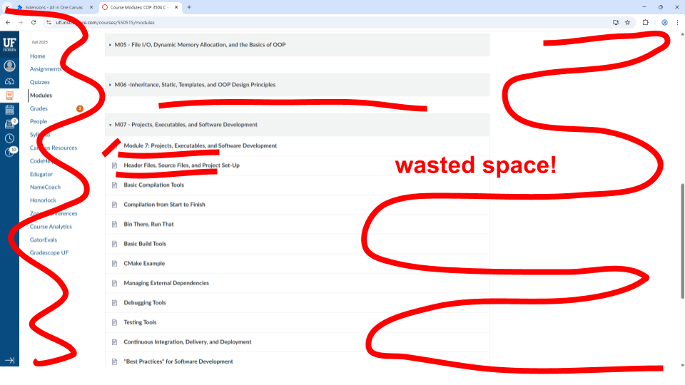
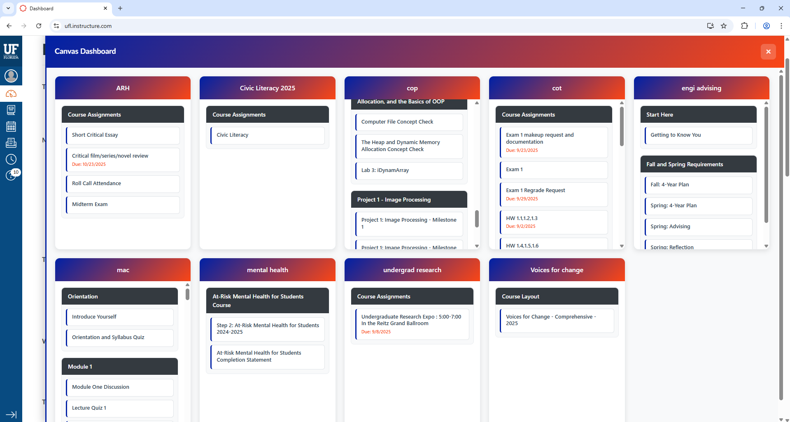
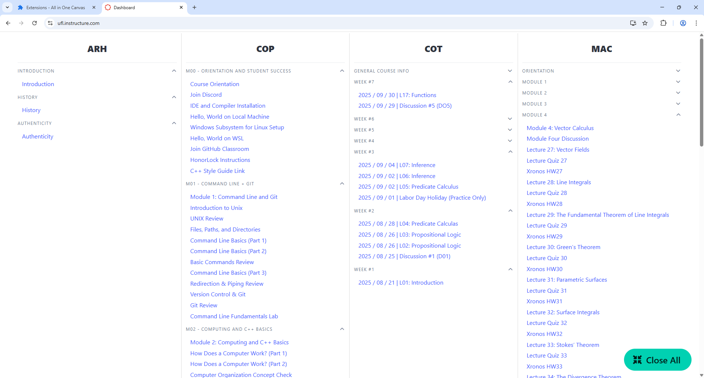

# Canvas All-In-One

### Project Overview

The current Canvas dashboard often requires multiple clicks to access assignments and modules within each course. Our goal was to streamline this workflow by compressing Canvas into 1 page, reducing time and effort spent navigating to essential content.

## Our Solution

We developed a new dashboard layout that greatly increases the information density of module pages on Canvas.

Version A             |  Version B
:-------------------------:|:-------------------------:
  |  

### Version A:
Lists assignments and modules within scrollable cells for each class.

Allows independent scrolling per column, so users can browse without losing context.

Automatically wraps to a new row after four columns to maintain readability.

Includes a toggle button on the right side of the screen to switch to the original Canvas UI.
(Though this could be added to version B)

### Version B:
Cleaner, more space efficient aesthetic, where classes are purely divided into columns.

Collapsable subheadings for each module.

# Setup
Clone the repo (or download ZIP) and run: 

**Version A** : `git checkout main`

**Version B** : `git checkout versionB`

Open the page [chrome://extensions](chrome://extensions) and toggle **developer mode** in the upper right.

Begin to **load an unpacked extension** from the upper left and select the all-in-one project.

Navigate to [https://ufl.instructure.com/](https://ufl.instructure.com/) and log in if necessary.